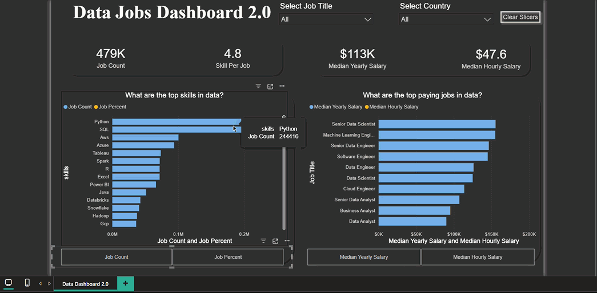
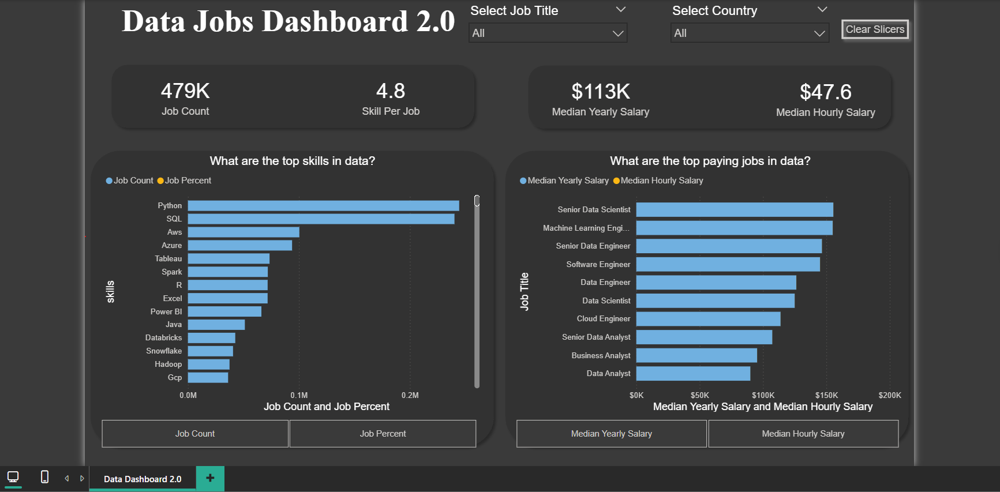

# Power BI Data Jobs Dashboard 2.0 📊

An advanced Power BI dashboard analyzing real-world data job postings — built using **Power Query**, **DAX**, and **Field Parameters**. This is an upgraded version of the [first Power BI dashboard](https://github.com/arnav-is-op/powerbi-data-jobs-analysis), going deeper into data modeling, DAX measures, and dynamic interactivity.



---

## 📁 Project Structure

```
powerbi-data-jobs-dashboard-2/
├── data_dashboard_2.0.pbix     # Power BI report file
├── images/
│   ├── demo.gif                # Dashboard demo
│   └── dashboard.png           # Dashboard screenshot
└── README.md
```

---

## 📌 Overview

This dashboard answers two core questions for anyone exploring the data jobs market:
- **What are the top skills in data?** — ranked by job count and job percentage
- **What are the top paying jobs in data?** — ranked by median yearly and hourly salary

Users can filter by **Job Title** and **Country** simultaneously, and dynamically switch between metrics using interactive field parameter buttons — making the dashboard fully interactive without any page changes.

---

## 🖥️ Dashboard



---

## 📦 What's Inside

### KPI Cards
- **479K** — Total job postings analyzed
- **4.8** — Average number of skills required per job
- **$113K** — Median yearly salary across all roles
- **$47.6** — Median hourly salary across all roles

### Charts
- **Top Skills Bar Chart** — horizontal bar chart ranking the most in-demand skills (Python, SQL, AWS, Azure, Tableau, Spark, Power BI and more)
- **Top Paying Jobs Bar Chart** — horizontal bar chart ranking job titles by compensation (Senior Data Scientist, Machine Learning Engineer, Data Engineer and more)
- Both charts are **dynamically switchable** using field parameter buttons

### Slicers & Filters
- **Select Job Title** — dropdown slicer filtering all visuals by any specific role
- **Select Country** — dropdown slicer filtering all visuals by any country
- **Clear Slicers button** — resets all filters instantly with one click

### Field Parameter Buttons
- **Job Count ↔ Job Percent** — switch the skills chart metric instantly
- **Median Yearly Salary ↔ Median Hourly Salary** — switch the salary chart metric instantly

### DAX Measures Used
- `Job Count` — total count of job postings
- `Job Percent` — percentage of jobs requiring each skill
- `Median Yearly Salary` — median yearly salary across filtered postings
- `Median Hourly Salary` — median hourly salary across filtered postings
- `Skill Per Job` — average number of skills listed per job posting
- `Skill Count` — total count of skills across all postings

### Data Model
- Built across multiple tables — **job_postings_fact**, **company_dim**, **date_dim**
- Relationships established between fact and dimension tables in Power BI model view

### Design & Formatting
- Consistent color theme throughout the dashboard
- Rounded card shapes with clear labels
- Clean layout with visual titles phrased as business questions
- Responsive to all slicer and parameter selections

---

## ✨ Key Features

- **Field Parameters** — dynamically switch chart metrics using buttons without changing the report
- **DAX Explicit Measures** — all KPIs and chart metrics built using custom DAX measures
- **Power Query** — data imported, cleaned and transformed before loading into the model
- **Multi-table Data Model** — fact and dimension table relationships
- **Cross-filtering slicers** — Job Title and Country slicers filter all visuals simultaneously
- **Clear Slicers button** — one click to reset all filters

---

## 🛠️ Tools & Concepts Used

- **Power BI Desktop** — report building, data modeling, dashboard design
- **Power Query** — data import, cleaning, advanced transformations, Append vs Merge, M Language
- **DAX** — explicit measures, field parameters, calculated metrics
- **Data Modeling** — fact and dimension table relationships

---

## 📓 Notes

### Chapter 2 — Power Query
Covers data import, Power Query Editor, advanced transformations, Append vs Merge, and M Language.

👉 [View Power Query Notes on Google Colab](https://colab.research.google.com/drive/15CzT15hc_eNVVGq3HlV7a0Hnod4MZNtY)

### Chapter 3 — DAX
Covers DAX introduction, explicit measures, and field parameters — including the full process of building this dashboard.

👉 [View DAX Notes on Google Colab](https://colab.research.google.com/drive/1BXPbXRq4AXB2wtVn1D9IVWl5Cz3Pnja7#scrollTo=OLUIyL0ZDhB7)

---

## 🗃️ Dataset

**Source:** Luke Barousse's Data Jobs Dataset  
**Size:** 479,000 job postings  
**Period:** January 2024 – December 2024  
**Fields include:** job title, company name, salary (yearly & hourly), location, job type, WFH status, degree requirement, health insurance, skills

---

## 🔗 Related Projects

The same dataset has been analyzed across multiple tools — check these out for more insights:

- [Power BI Data Jobs Analysis](https://github.com/arnav-is-op/powerbi-data-jobs-analysis) — First Power BI project with drill-through dashboard and 15+ visualization types
- [Python Job Postings Analysis](https://github.com/arnav-is-op/python_project_for_job_analysis) — End-to-end Python/Pandas analysis with Matplotlib & Seaborn visualizations
- [SQL Data Jobs Analysis](https://github.com/arnav-is-op/SQL_Project_Data_Job_Analysis) — SQL-based job market analysis with extended dataset

---

## 👤 Author

**Arnav Heerakar**
